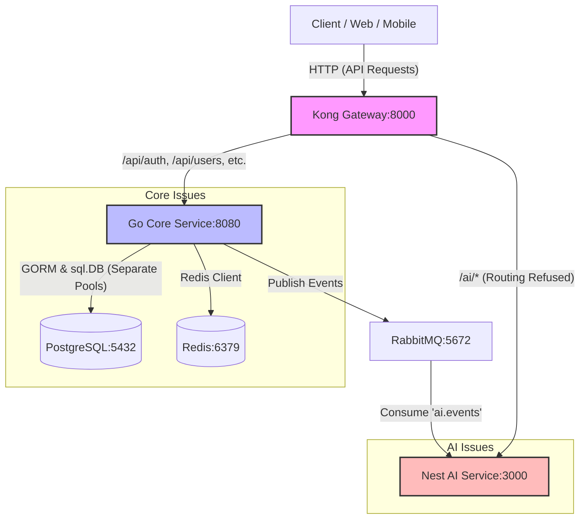

# Infrastructure and Architectural Review - ProductTrace AI

Tài liệu này đánh giá toàn diện kiến trúc hiện tại, hạ tầng kỹ thuật (Docker, Kong Gateway), cơ sở dữ liệu (PostgreSQL, Redis) và cơ chế hàng đợi sự kiện (RabbitMQ) của dự án **ProductTrace AI** nhằm xác định mức độ sẵn sàng cho môi trường Production (Production Readiness).

---

## 1. Kiến Trúc Tổng Quan (Overall Architecture)

### Các Service Hiện Có và Vai Trò
Hệ thống ProductTrace AI được thiết kế theo mô hình Microservices / Distributed Services:
1. **Kong Gateway**: Đóng vai trò là API Gateway (API entrypoint) cho hệ thống, chịu trách nhiệm định tuyến (routing) yêu cầu từ bên ngoài tới các service nội bộ.
2. **Go Core Service (`go-core-service`)**: Service trung tâm, xử lý các nghiệp vụ core bao gồm: Quản lý người dùng (User), Xác thực (Authentication), Lô hàng (Batch), Sản phẩm (Product), QR code và xuất PDF.
3. **Nest AI Service (`nest-ai-service`)**: Service chạy bằng NestJS đóng vai trò xử lý các tác vụ bất đồng bộ liên quan đến AI (như embedding, vector search, geo-search). Hiện tại đang ở dạng skeleton chỉ cấu hình tiêu thụ sự kiện từ RabbitMQ.
4. **PostgreSQL (với PostGIS)**: Cơ sở dữ liệu quan hệ lưu trữ dữ liệu nghiệp vụ chính (Users, Products, Batches, Locations, v.v.) và hỗ trợ truy vấn không gian qua PostGIS.
5. **Redis**: Cache lưu trữ OTP tạm thời và Refresh Token cho luồng bảo mật.
6. **RabbitMQ**: Message Broker đóng vai trò làm xương sống cho kiến trúc hướng sự kiện (Event-Driven Architecture), truyền nhận thông điệp bất đồng bộ giữa các service.

### Phụ Thuộc (Dependency Map)
- `Kong Gateway` phụ thuộc trực tiếp vào `go-core-service` và `nest-ai-service` để định tuyến HTTP.
- `go-core-service` phụ thuộc trực tiếp vào `PostgreSQL`, `Redis` và `RabbitMQ`.
- `nest-ai-service` phụ thuộc trực tiếp vào `RabbitMQ` để tiêu thụ sự kiện và `Redis`.
- `migrate` (schema migration tool) phụ thuộc vào `PostgreSQL`.

### Data Flow & Event Flow



- **API Request Flow**: Client gửi request qua Kong Gateway (Port 8000). Kong chuyển tiếp request `/api` tới `go-core-service` (Port 8080) và `/ai` tới `nest-ai-service` (Port 3000).
- **Database Flow**: `go-core-service` sử dụng hai connection pool song song tới PostgreSQL (một qua GORM, một qua raw SQL cho Batch) và một connection pool tới Redis.
- **Event Flow**: Khi người dùng thực hiện các hành động (như đăng ký hoặc xác thực OTP), `go-core-service` publish event lên RabbitMQ exchange (`product-trace.events`). Nest AI Service lắng nghe queue `ai.events` để nhận tin nhắn bất đồng bộ.

---

## 2. RabbitMQ Review

### Các thành phần RabbitMQ trong source code
* **Package rabbitmq**: [internal/events/rabbitmq](file:///d:/producttrace-ai/apps/go-core-service/internal/events/rabbitmq) (Go) và [src/messaging/rabbitmq](file:///d:/producttrace-ai/apps/nest-ai-service/src/messaging/rabbitmq) (NestJS).
* **Publisher / Producer**: [internal/events/publisher/publisher.go](file:///d:/producttrace-ai/apps/go-core-service/internal/events/publisher/publisher.go) sử dụng `rabbitmq.Manager` để gửi tin nhắn.
* **Consumer**: [src/messaging/consumers/product-created.consumer.ts](file:///d:/producttrace-ai/apps/nest-ai-service/src/messaging/consumers/product-created.consumer.ts) tiêu thụ sự kiện `product.created`.
* **Exchange**: `product-trace.events` (Event Exchange dạng `topic`) và `product-trace.dlx` (DLX Exchange dạng `direct`), định nghĩa tại [internal/events/rabbitmq/constants.go:L5-6](file:///d:/producttrace-ai/apps/go-core-service/internal/events/rabbitmq/constants.go#L5-L6).
* **Queue**: `ai.events` (Main Queue) và `ai.events.dlq` (Dead Letter Queue), định nghĩa tại [internal/events/rabbitmq/config.go:L4-5](file:///d:/producttrace-ai/apps/go-core-service/internal/events/rabbitmq/config.go#L4-L5).
* **Routing Key**:
  * Các RK nghiệp vụ (ví dụ: `user.registered`, `user.verified`, `product.created`) định nghĩa tại [internal/events/rabbitmq/constants.go:L12-40](file:///d:/producttrace-ai/apps/go-core-service/internal/events/rabbitmq/constants.go#L12-L40).
  * DLQ Routing Key: `ai.events.failed` định nghĩa tại [internal/events/rabbitmq/config.go:L7](file:///d:/producttrace-ai/apps/go-core-service/internal/events/rabbitmq/config.go#L7).

---

### Điểm đang làm tốt
1. **Connection Manager & Reconnect Strategy**: Lớp `Manager` trong Go ([manager.go](file:///d:/producttrace-ai/apps/go-core-service/internal/events/rabbitmq/manager.go)) quản lý kết nối rất tốt thông qua cơ chế tự động reconnect sử dụng Exponential Backoff có giới hạn tối đa `30s` ([manager.go:L165-193](file:///d:/producttrace-ai/apps/go-core-service/internal/events/rabbitmq/manager.go#L165-L193)). Cơ chế thread-safe sử dụng `sync.RWMutex` và bảo vệ reconnect trùng lặp thông qua `atomic.CompareAndSwapInt32` ([manager.go:L150-153](file:///d:/producttrace-ai/apps/go-core-service/internal/events/rabbitmq/manager.go#L150-L153)).
2. **Publisher Confirm**: Hàm `publishOnce` ([manager.go:L233-268](file:///d:/producttrace-ai/apps/go-core-service/internal/events/rabbitmq/manager.go#L233-L268)) sử dụng `ch.PublishWithDeferredConfirmWithContext` và block đợi ack từ Broker qua `confirm.Wait()`. Đảm bảo tin nhắn được lưu trữ tại Broker trước khi trả về thành công cho ứng dụng.
3. **Durable & Persistent**: Exchange và Queue được declare bền vững (`durable: true`), tin nhắn được gửi với `DeliveryMode: amqp.Persistent` ([manager.go:L252](file:///d:/producttrace-ai/apps/go-core-service/internal/events/rabbitmq/manager.go#L252)), đảm bảo dữ liệu không bị mất khi RabbitMQ restart.
4. **Exchange Design**: Sử dụng Topic Exchange (`product-trace.events`) cho phép các service đăng ký nhận tin nhắn linh hoạt thông qua routing key pattern.

---

### Vấn đề tiềm ẩn (Gaps / Risks)

#### 1. Thiếu Cơ Chế Publish Outbox (Dual-Write Risk)
- **Vị trí**: [internal/modules/authen/service/authen_service.go:L66-99](file:///d:/producttrace-ai/apps/go-core-service/internal/modules/authen/service/authen_service.go#L66-L99) (RegisterUser) và [internal/modules/user/service/user_service.go:L255-290](file:///d:/producttrace-ai/apps/go-core-service/internal/modules/user/service/user_service.go#L255-L290) (UpdateProfile).
- **Tác động**: Hệ thống thực hiện ghi Database trước, sau đó publish sự kiện ra RabbitMQ. Nếu publish thất bại (do mạng, hàng đợi bị nghẽn), Database đã ghi nhận nhưng sự kiện không được gửi đi. Việc này dẫn đến mất đồng bộ dữ liệu vĩnh viễn giữa Go Core và Nest AI (ví dụ: User không được gửi OTP kích hoạt).
- **Giải pháp**: Triển khai **Transactional Outbox Pattern**. Thay vì gửi trực tiếp, ghi sự kiện vào bảng `outbox_events` trong cùng một database transaction, sau đó dùng một background worker quét bảng và publish.

#### 2. Startup Race Condition & Định Nghĩa Topology Phía Consumer
- **Vị trí**: [apps/nest-ai-service/src/main.ts:L17-24](file:///d:/producttrace-ai/apps/nest-ai-service/src/main.ts#L17-L24) so với [apps/go-core-service/internal/events/rabbitmq/topology.go:L42-87](file:///d:/producttrace-ai/apps/go-core-service/internal/events/rabbitmq/topology.go#L42-L87).
- **Tác động**: Nest AI Service cấu hình lắng nghe queue `ai.events` với arguments trỏ tới exchange `product-trace.dlx`. Nếu Nest AI Service khởi động trước và tạo queue trước khi Go Core Service chạy hàm `SetupTopology`, thì Exchange `product-trace.dlx` chưa hề tồn tại trong RabbitMQ. Khi đó RabbitMQ sẽ báo lỗi channel và shutdown kết nối của consumer ngay lập tức do trỏ tới một DLX không tồn tại.
- **Giải pháp**: Cấu hình Nest AI Service hoặc Go Core Service tự động khởi tạo toàn bộ Exchange (bao gồm DLX) trước khi khai báo và liên kết các queue.

#### 3. Thiếu Cơ Chế Retry Queue (Chỉ gửi thẳng tới DLQ)
- **Vị trí**: [apps/nest-ai-service/src/messaging/consumers/product-created.consumer.ts:L24](file:///d:/producttrace-ai/apps/nest-ai-service/src/messaging/consumers/product-created.consumer.ts#L24).
- **Tác động**: Khi xử lý tin nhắn gặp lỗi (ví dụ: DB lock tạm thời, network timeout tới OpenAI), consumer lập tức gọi `channel.nack(message, false, false)` (requeue = false). Điều này đẩy tin nhắn thẳng vào DLQ (`ai.events.dlq`) mà không qua bất kỳ lượt retry nào.
- **Giải pháp**: Thiết kế hệ thống retry hàng đợi sử dụng **TTL Queues** (Delay Queues) và **Dead Letter Exchange**. Khi xử lý thất bại, gửi tin nhắn tới một retry exchange với TTL (ví dụ: 5s, 10s, 30s) trước khi quay lại main queue. Chỉ gửi tới DLQ khi số lần retry vượt quá giới hạn (ví dụ: 3-5 lần).

#### 4. Thiếu Idempotency Check (Duplicate Processing)
- **Vị trí**: [apps/nest-ai-service/src/messaging/consumers/product-created.consumer.ts:L12-26](file:///d:/producttrace-ai/apps/nest-ai-service/src/messaging/consumers/product-created.consumer.ts#L12-L26).
- **Tác động**: RabbitMQ đảm bảo phân phối tin nhắn ít nhất một lần (At-least-once). Khi xảy ra chập chờn mạng tại thời điểm gửi Ack, Broker sẽ gửi lại tin nhắn. Consumer Nest AI hiện tại xử lý trực tiếp tin nhắn mà không kiểm tra xem `eventId` hay `correlationId` đã được xử lý chưa, dẫn đến việc xử lý trùng lặp dữ liệu.
- **Giải pháp**: Tại Consumer, lưu `eventId` vào Redis với một khoảng TTL ngắn (ví dụ: 24h) hoặc ghi nhận vào bảng log sự kiện đã xử lý trong DB. Trước khi xử lý tin nhắn mới, cần kiểm tra trùng lặp (de-duplication).

#### 5. Sự Kiện Nghiệp Vụ Chưa Được Phát Ra (Missing Publishing)
- **Vị trí**: [apps/go-core-service/internal/modules/product/services/product_service.go:L43-102](file:///d:/producttrace-ai/apps/go-core-service/internal/modules/product/services/product_service.go#L43-L102) (`CreateProduct`) và [apps/go-core-service/internal/modules/batch/services/batch_service.go:L48-71](file:///d:/producttrace-ai/apps/go-core-service/internal/modules/batch/services/batch_service.go#L48-L71) (`CreateBatch`).
- **Tác động**: Mặc dù hệ thống định nghĩa các routing key như `product.created`, `batch.created`, tuy nhiên trong service nghiệp vụ tạo sản phẩm và lô hàng hoàn toàn **không** gọi publisher để phát sự kiện! Nest AI Service sẽ không bao giờ nhận được bất kỳ tin nhắn nào khi người dùng tạo sản phẩm hay lô hàng thật (chỉ nhận được khi gọi API test `/test-event` tại `main.go`).
- **Giải pháp**: Tích hợp publisher vào các service này và phát sự kiện sau khi nghiệp vụ hoàn tất thành công.

---

### Production Readiness Score (RabbitMQ)

| Tiêu chí | Điểm (Thang 10) | Nhận xét |
| --- | --- | --- |
| **Reliability** | 6/10 | Gửi tin nhắn tin cậy (Publisher Confirm, Persistent), nhưng thiếu Transactional Outbox khiến việc lưu trữ tổng thể không đảm bảo tính nhất quán dữ liệu. |
| **Scalability** | 7/10 | Cấu hình Topic Exchange cho phép mở rộng tốt các consumer. Tuy nhiên, thiếu cơ chế prefetch count cấu hình cho consumer khiến một consumer có thể bị quá tải tin nhắn. |
| **Fault Tolerance** | 5/10 | Có DLQ nhưng thiếu Retry Queue dẫn đến việc tin nhắn lỗi nhất thời bị vứt bỏ vào DLQ quá sớm, yêu cầu can thiệp thủ công nhiều. |
| **Maintainability** | 6/10 | Cấu trúc code quản lý connection Go tốt, nhưng thiếu tracing context propagation qua header làm mất khả năng giám sát luồng đi của tin nhắn. |

**Tổng điểm trung bình: 6.0 / 10**

---

### Đề Xuất Cải Tiến (RabbitMQ)
* **Critical**:
  * Tích hợp publisher vào nghiệp vụ thực tế như `CreateProduct` và `CreateBatch` để Nest AI nhận được dữ liệu.
  * Áp dụng Transactional Outbox Pattern cho các luồng đăng ký user (`RegisterUser`) và cập nhật nghiệp vụ để tránh mất mát sự kiện.
* **High**:
  * Triển khai Retry Queue (sử dụng x-dead-letter-exchange kết hợp TTL) tại Nest AI Consumer trước khi đưa tin nhắn vào DLQ.
  * Thêm kiểm tra Idempotency tại Nest AI Service bằng cách lưu `eventId` đã xử lý vào Redis.
* **Medium**:
  * Triển khai Tracing Context Propagation (chèn traceparent/W3C context vào AMQP header Properties khi publish và giải mã tại Nest AI).
* **Low**:
  * Cấu hình tham số `prefetch` (ví dụ: `prefetch: 10`) tại Nest AI consumer để điều tiết lưu lượng xử lý tin nhắn của từng container.

---

## 3. Redis Review

### Redis đang được dùng để làm gì trong source code?
Dựa trên source code thực tế, Redis chỉ được sử dụng trong module xác thực (`AuthenService`):
1. **Lưu trữ mã OTP**: Sử dụng khi người dùng đăng ký tài khoản. Lưu mã OTP dạng chuỗi kết hợp với email: `otp:email:<email>` với giá trị là mã OTP ([authen_service.go:L78](file:///d:/producttrace-ai/apps/go-core-service/internal/modules/authen/service/authen_service.go#L78)).
2. **Lưu trữ Refresh Token**: Lưu thông tin refresh token hoạt động của người dùng dạng: `refresh_token:<user_id>:<hashed_token>` với giá trị là `user_id` ([authen_service.go:L137](file:///d:/producttrace-ai/apps/go-core-service/internal/modules/authen/service/authen_service.go#L137)).

---

### Đánh Giá TTL (Time-To-Live)
* **OTP TTL**: Thiết lập `5 phút` ([authen_service.go:L78](file:///d:/producttrace-ai/apps/go-core-service/internal/modules/authen/service/authen_service.go#L78)). Mức cấu hình này hoàn toàn hợp lý cho mã OTP xác thực email, đảm bảo thời gian đủ cho người dùng nhận email và nhập mã, đồng thời giảm thiểu rủi ro brute-force mã nếu hết hạn nhanh.
* **Refresh Token TTL**: Thiết lập `7 ngày` ([authen_service.go:L147](file:///d:/producttrace-ai/apps/go-core-service/internal/modules/authen/service/authen_service.go#L147)). Đây là mức TTL chuẩn hóa cho các ứng dụng web/mobile di động, cân bằng tốt giữa trải nghiệm người dùng (không phải login lại quá thường xuyên) và tính bảo mật.

---

### Đánh Giá Bảo Mật (Security & Key Design)

#### 1. Lưu Trữ Token / OTP
- **Token Hashing**: Hệ thống thực hiện băm token bằng SHA-256 (`utils.HashToken`) trước khi ghi key vào Redis: `refresh_token:<user_id>:<hashed_token>` ([authen_service.go:L137](file:///d:/producttrace-ai/apps/go-core-service/internal/modules/authen/service/authen_service.go#L137)). Điều này rất tốt vì nếu Redis bị rò rỉ dữ liệu, kẻ tấn công cũng không thể biết giá trị raw token để giả mạo client.
- **OTP Plaintext**: OTP được lưu trực tiếp dưới dạng chuỗi thô (plaintext) trong Redis. Do OTP chỉ có hiệu lực 5 phút và tự động xóa sau khi verify thành công nên mức độ rủi ro có thể chấp nhận được, nhưng tốt nhất vẫn nên hash OTP.

#### 2. Không Đồng Nhất Key Naming (Naming Mismatch)
- **Vị trí**: [pkg/cache/redis_key.go:L5-11](file:///d:/producttrace-ai/apps/go-core-service/pkg/cache/redis_key.go#L5-L11) so với [internal/modules/authen/service/authen_service.go:L78, L137](file:///d:/producttrace-ai/apps/go-core-service/internal/modules/authen/service/authen_service.go#L78).
- **Tác động**: File `redis_key.go` định nghĩa hai helper: `RefreshTokenKey(userID int)` trả về `refresh:token:%d` và `OTPKey(email string)` trả về `otp:%s`. Tuy nhiên, trong `authen_service.go`, lập trình viên hoàn toàn bỏ qua helper này và hardcode chuỗi định dạng khác:
  - OTP Key hardcode: `"otp:email:%s"`
  - Refresh Token Key hardcode: `"refresh_token:%s:%s"`
  - Hơn nữa, helper `RefreshTokenKey` nhận tham số `userID int` trong khi ID thực tế của User lại là chuỗi UUID (`user.ID.String()`). Điều này khiến helper này bị lỗi biên dịch hoặc lỗi logic nếu sử dụng.
- **Giải pháp**: Cập nhật lại `redis_key.go` hỗ trợ UUID dạng string và sử dụng đồng bộ các hàm helper này để tạo key, tránh key-collision hoặc sai lệch prefix.

#### 3. Rủi ro Scan Blocking (Performance Bottleneck)
- **Vị trí**: [pkg/cache/redis_cache.go:L54-67](file:///d:/producttrace-ai/apps/go-core-service/pkg/cache/redis_cache.go#L54-L67) (`DeletePattern`).
- **Tác động**: Hàm `DeletePattern` sử dụng lệnh `SCAN` để tìm và xóa key khớp với pattern. Khi số lượng session tăng lên hàng chục ngàn hay hàng triệu key, việc gọi lệnh `SCAN` sẽ chiếm dụng CPU của Redis (vì Redis chạy đơn luồng), gây nghẽn kết nối và làm chậm toàn bộ các API khác sử dụng Redis.
- **Giải pháp**: Không sử dụng `SCAN` để thu hồi token. Thay vào đó, gom nhóm các token của một người dùng bằng cấu trúc dữ liệu **Redis Set** (ví dụ: key `user:tokens:<user_id>`). Khi cần thu hồi, chỉ cần lấy danh sách từ Set và xóa trực tiếp các key liên quan với độ phức tạp $O(1)$.

---

### Production Readiness Score (Redis)

| Tiêu chí | Điểm (Thang 10) | Nhận xét |
| --- | --- | --- |
| **Security** | 8/10 | Refresh Token được băm (hash) trước khi lưu. OTP lưu plaintext nhưng thời gian sống ngắn. |
| **Performance** | 5/10 | Hàm `DeletePattern` sử dụng `SCAN` là một quả bom nổ chậm về mặt hiệu năng khi hệ thống đạt tải lớn. |
| **Reliability** | 7/10 | Cấu hình pool và timeout hợp lý, tuy nhiên thiếu cơ chế "fail-silent" cho cache khi Redis gặp sự cố (Redis sập làm API sập theo). |

**Tổng điểm trung bình: 6.7 / 10**

---

### Đề Xuất Cải Tiến (Redis)
1. **High**:
   - Refactor hàm `DeletePattern` sử dụng Redis Set hoặc Hash thay vì scan key-space.
   - Sửa đổi và đồng bộ hóa các helper định nghĩa key trong [pkg/cache/redis_key.go](file:///d:/producttrace-ai/apps/go-core-service/pkg/cache/redis_key.go) để sử dụng trong `authen_service.go`.
2. **Medium**:
   - Thêm cơ chế "fail-silent" hoặc fallback trong tầng cache cho các luồng nghiệp vụ không thiết yếu (như cache danh sách sản phẩm). Nếu Redis sập, service tự động truy vấn thẳng DB mà không trả lỗi 500 cho client.

---

## 4. Cache Strategy Review

### Chiến lược Cache hiện tại
Dự án **chưa áp dụng bất kỳ chiến lược cache nào** cho các thực thể nghiệp vụ cốt lõi (Products, Users, Batches).
- Hệ thống chỉ đang dùng Redis làm nơi lưu trữ dữ liệu tạm thời (OTP) và Session Store (Refresh Token), không dùng Redis làm bộ đệm hiệu năng (Cache Layer).
- Mọi yêu cầu lấy danh sách sản phẩm `/api/products`, lấy chi tiết lô hàng `/api/batches` hay chi tiết người dùng `/api/users` đều truy cập trực tiếp vào PostgreSQL.

---

### Đánh giá tác động khi thiếu Cache
- **Cache Hit Ratio**: Hiện tại là `0%` do không có cache cho dữ liệu đọc.
- **Database Load**: PostgreSQL sẽ nhanh chóng bị quá tải CPU/IOPS khi số lượng người dùng thực hiện quét mã QR sản phẩm tăng cao (luồng quét QR đọc dữ liệu chi tiết lô hàng/sản phẩm liên tục).
- **Latency**: Thời gian phản hồi của các API đọc sẽ phụ thuộc hoàn toàn vào tốc độ truy vấn của DB, không đạt được tốc độ phản hồi < 10ms của Redis.

---

### Đề Xuất Thiết Kế Lớp Cache (Caching Proposal)

#### 1. Product Cache (Cache-Aside Strategy)
- **Mô tả**: Khi người dùng yêu cầu xem chi tiết sản phẩm, hệ thống đọc từ Redis trước. Nếu không có (Cache Miss), đọc từ Postgres, lưu lại vào Redis với TTL `1 hour` rồi trả về cho client.
- **Invalidation**: Khi Admin cập nhật hoặc xóa sản phẩm (`UpdateProduct`, `DeleteProduct`), thực hiện xóa key cache tương ứng trong Redis để đảm bảo tính nhất quán dữ liệu.

#### 2. Batch and QR Cache (Cache-Aside Strategy)
- **Mô tả**: Dữ liệu lô hàng (`batches`) và thông tin sản phẩm vật lý (`product_items` gắn với QR code) là dữ liệu gần như **tĩnh** (sau khi sản xuất và đóng gói, thông tin lô hàng rất hiếm khi thay đổi). Do đó, dữ liệu này cực kỳ thích hợp để cache với TTL dài (ví dụ: `24 hours`).
- **Tác động**: Giảm tải hơn 90% truy vấn đọc tới PostgreSQL khi người dùng thực hiện quét QR code ngoài thị trường để truy xuất nguồn gốc.

#### 3. AI Result Cache (Cache-Aside Strategy)
- **Mô tả**: Kết quả phân tích hoặc gợi ý của AI (Vector Search, Recommendation) phản hồi khá chậm và tốn tài nguyên tính toán. Cache kết quả này theo tham số đầu vào (query hash) với TTL `30 minutes` đến `2 hours`.

---

## 5. Docker & Infrastructure Review

### Đánh Giá docker-compose.yml và docker-compose.kong.yml

#### 1. Startup Order & Race Conditions
Nhìn chung, cấu hình `depends_on` trong [docker-compose.yml](file:///d:/producttrace-ai/docker-compose.yml) được thiết lập khá chi tiết với các điều kiện `service_healthy` và `service_completed_successfully`:
- `migrate` đợi `postgres` đạt trạng thái `healthy` ([docker-compose.yml:L85-87](file:///d:/producttrace-ai/docker-compose.yml#L85-L87)).
- `go-core-service` đợi `migrate` hoàn thành thành công (`service_completed_successfully`), `redis` và `rabbitmq` đạt trạng thái `healthy` ([docker-compose.yml:L115-123](file:///d:/producttrace-ai/docker-compose.yml#L115-L123)).

Tuy nhiên, vẫn tồn tại các race condition nghiêm trọng sau:

##### Race Condition 1: Kong Gateway khởi động song song không đồng bộ
- **Vị trí**: [docker-compose.kong.yml](file:///d:/producttrace-ai/docker-compose.kong.yml).
- **Tác động**: Kong Gateway không hề định nghĩa `depends_on` hay kiểm tra trạng thái của `go-core-service` và `nest-ai-service`. Khi toàn bộ stack được khởi động (`docker compose up`), Kong Gateway có thể sẵn sàng nhận yêu cầu từ client và định tuyến trước khi Go Core Service hoặc Nest AI Service hoàn tất khởi tạo kết nối Database/RabbitMQ, dẫn đến lỗi HTTP 502/504 đầu ngày.
- **Giải pháp**: Thêm `depends_on` vào service `kong` trong compose file trỏ tới các backend service.

---

### Các Container Chắc Chắn Sẽ Fail Khi Khởi Động (Boot Failures)

#### 1. Go Core Service (`go-core-service`) - Lỗi Driver Database
- **Vị trí**: [internal/database/postgres_connect_db.go:L66](file:///d:/producttrace-ai/apps/go-core-service/internal/database/postgres_connect_db.go#L66) (`ConnectPostgresSQL`).
- **Đoạn code lỗi**:
  ```go
  return sql.Open("pgx", dsn)
  ```
- **Tác động**: Hàm này cố gắng mở một kết nối database sử dụng driver tên `"pgx"`. Tuy nhiên, trong toàn bộ codebase (bao gồm [cmd/api/main.go](file:///d:/producttrace-ai/apps/go-core-service/cmd/api/main.go)), dự án chỉ đăng ký driver `"postgres"` thông qua import:
  ```go
  import _ "github.com/lib/pq"
  ```
  Không có gói stdlib wrapper của `pgx` (như `github.com/jackc/pgx/v5/stdlib`) được import dạng blank để đăng ký driver `"pgx"`. Do đó, khi Go Core Service khởi động và gọi `ConnectPostgresSQL()`, nó sẽ crash ngay lập tức với lỗi:
  ```text
  panic: sql: unknown driver "pgx" (forgotten import?)
  ```
- **Khắc phục**: Thay đổi driver name thành `"postgres"` (do đã import `lib/pq`):
  ```go
  return sql.Open("postgres", dsn)
  ```
  Hoặc bổ sung import của `pgx/stdlib` trong `postgres_connect_db.go` hoặc `main.go`.

#### 2. Nest AI Service (`nest-ai-service`) - Kong Routing Refused (Port 3000)
- **Vị trí**: [apps/nest-ai-service/src/main.ts:L8-31](file:///d:/producttrace-ai/apps/nest-ai-service/src/main.ts#L8-L31) so với [infra/kong/kong.yml:L13-20](file:///d:/producttrace-ai/infra/kong/kong.yml#L13-L20) và [docker-compose.yml:L146-147](file:///d:/producttrace-ai/docker-compose.yml#L146-L147).
- **Tác động**:
  - Nest AI Service được cấu hình trong `main.ts` **chỉ khởi động như một RMQ Microservice**:
    ```typescript
    const app = await NestFactory.createMicroservice<MicroserviceOptions>(AppModule, {
        transport: Transport.RMQ,
        ...
    });
    await app.listen();
    ```
    Hàm `createMicroservice` chỉ lắng nghe tin nhắn từ RabbitMQ. Nó **không mở bất kỳ cổng HTTP nào** (cổng 3000 hoàn toàn bị đóng trên container).
  - Tuy nhiên, `docker-compose.yml` lại expose port `"3000:3000"` và Kong Gateway cấu hình định tuyến request `/ai` tới `http://nest-ai-service:3000`.
  - Kết quả là bất kỳ request HTTP nào gửi từ client qua Gateway tới `/ai` đều sẽ thất bại hoàn toàn với lỗi `502 Bad Gateway` hoặc `Connection Refused` do container Nest AI không lắng nghe HTTP.
- **Khắc phục**: 
  - Nếu Nest AI Service cần expose API HTTP, cần sửa đổi `main.ts` để khởi động dạng **Hybrid Application** (vừa lắng nghe HTTP port 3000 qua `NestFactory.create(AppModule)`, vừa kết nối microservice qua `app.connectMicroservice(...)`).
  - Nếu Nest AI Service thuần túy chỉ xử lý hàng đợi, cần gỡ bỏ phần mapping port trong compose và cấu hình routing `/ai` trong Kong Gateway.

#### 3. Go Core Service (`go-core-service`) - Lỗi Lấy Môi Trường Không Đúng (`GetEnvAsInt`)
- **Vị trí**: [internal/utils/helper.go:L17-27](file:///d:/producttrace-ai/apps/go-core-service/internal/utils/helper.go#L17-L27) (`GetEnvAsInt`).
- **Đoạn code lỗi**:
  ```go
  func GetEnvAsInt(key string, defaultValue int) int {
  	value := os.Getenv(key)
  	if value != "" {
  		return defaultValue
  	}
  	intvalue, err := strconv.Atoi(value)
  	if err != nil {
  		return defaultValue
  	}
  	return intvalue
  }
  ```
- **Tác động**: Điều kiện `if value != ""` trả về `defaultValue` là sai logic! Nếu biến môi trường **có tồn tại** (khác rỗng), hàm lại trả về giá trị mặc định, ngược lại nếu rỗng thì hàm thực hiện chuyển đổi chuỗi rỗng `""` sang số và ném lỗi rồi trả về giá trị mặc định. Vì lỗi logic này, cấu hình biến môi trường dạng số (như `REDIS_DB` hay các port cấu hình dạng số) sẽ **luôn luôn trả về giá trị mặc định**, bỏ qua cấu hình thực tế trong `.env`!
- **Khắc phục**: Sửa điều kiện so sánh thành `if value == ""`:
  ```go
  if value == "" {
  	return defaultValue
  }
  ```

#### 4. Go Core Service (`go-core-service`) - Không Load Môi Trường Khi Chạy Local
- **Vị trí**: [cmd/api/main.go](file:///d:/producttrace-ai/apps/go-core-service/cmd/api/main.go).
- **Tác động**: Mặc dù Go Core Service có khai báo phụ thuộc `github.com/joho/godotenv` trong `go.mod`, tuy nhiên trong `main.go` hoàn toàn không có lệnh gọi `godotenv.Load()`. Khi chạy service cục bộ (local development) ngoài Docker, các biến môi trường sẽ không được nạp từ file `.env`, dẫn đến việc kết nối DB/Redis sử dụng giá trị mặc định và bị fail kết nối.
- **Khắc phục**: Thêm lệnh nạp file `.env` ở đầu hàm `main()` trong `main.go`:
  ```go
  _ = godotenv.Load()
  ```

---

## 6. Authentication Infrastructure Review

### Đánh Giá Các Thành Phần Xác Thực

#### 1. Lỗ Hổng Bảo Mật Nghiêm Trọng: Xác Thực Giả Lập Qua Header (Header Injection Vulnerability)
- **Vị trí**: [internal/modules/user/handler/user_handler.go:L124, L145](file:///d:/producttrace-ai/apps/go-core-service/internal/modules/user/handler/user_handler.go#L124).
- **Đoạn code liên quan**:
  ```go
  actorID := c.GetHeader("X-User-Id")
  ```
- **Tác động**: 
  - API lấy profile (`GetProfile`) và cập nhật profile (`UpdateProfile`) lấy định danh người dùng trực tiếp từ HTTP Header `X-User-Id`.
  - Không có bất kỳ Middleware nào trong Go Core Service thực hiện xác thực chữ ký JWT hay validate tính hợp lệ của Header này.
  - Đồng thời, Kong Gateway ([kong.yml](file:///d:/producttrace-ai/infra/kong/kong.yml)) cũng không có cấu hình JWT plugin để gỡ bỏ/ghi đè header `X-User-Id` từ client gửi lên.
  - **Hệ quả**: Bất kỳ kẻ tấn công nào từ ngoài internet cũng có thể gửi một HTTP request trực tiếp tới cổng Kong Gateway (8000) kèm theo header tự chế `X-User-Id: <UUID_của_Admin>` để chiếm toàn quyền điều khiển tài khoản Admin hoặc bất kỳ người dùng nào mà không cần biết mật khẩu hay token của họ!
- **Khắc phục**: 
  - Viết một Middleware xác thực JWT trong Go Core Service ([internal/middleware](file:///d:/producttrace-ai/apps/go-core-service/internal/middleware)). Middleware này sẽ giải mã Access Token gửi trong header `Authorization: Bearer <token>`, trích xuất `user_id` và lưu vào Context của Gin (`c.Set("user_id", claims.UserID)`).
  - Không được đọc trực tiếp từ `X-User-Id` do client gửi lên trừ khi có cơ chế tin cậy từ API Gateway.

#### 2. Rủi Ro Brute Force Mã OTP
- **Vị trí**: [internal/modules/authen/service/authen_service.go:L157-172](file:///d:/producttrace-ai/apps/go-core-service/internal/modules/authen/service/authen_service.go#L157-L172) (`VerifyOTP`).
- **Tác động**: Khi người dùng nhập sai mã OTP, hệ thống chỉ trả về lỗi `Incorrect OTP code` mà không ghi nhận số lần sai hay thu hồi mã. Vì mã OTP chỉ dài 6 chữ số (1.000.000 khả năng), kẻ tấn công có thể chạy brute-force gửi hàng vạn request thử mã OTP trong vòng 5 phút (thời gian sống của OTP) mà không bị giới hạn hay khóa tài khoản.
- **Giải pháp**: 
  - Giới hạn số lần nhập sai tối đa (ví dụ: tối đa 5 lần nhập sai). Mỗi lần sai tăng biến đếm trong Redis. Nếu vượt quá giới hạn, xóa sạch OTP key trong Redis và yêu cầu người dùng sinh mã mới.

#### 3. Thiếu Blacklist Token Khi Đăng Xuất (Logout API)
- **Tác động**: Dự án hiện tại không xây dựng API Đăng xuất (`Logout`). Hơn nữa, vì Access Token có thời gian sống 15 phút và được ký offline, nếu không có cơ chế lưu trữ Blacklist token (các token bị vô hiệu hóa trước hạn), ta không thể vô hiệu hóa ngay lập tức một token bị đánh cắp trước khi nó tự hết hạn.
- **Giải pháp**: Xây dựng API `/auth/logout` và lưu các JWT Access Token bị đăng xuất vào Redis với thời gian sống bằng với thời gian còn lại của token (tối đa 15 phút). Middleware xác thực sẽ kiểm tra nếu token nằm trong blacklist thì từ chối truy cập.

---

### Tóm tắt Token Lifecycle & Cryptography
* **JWT Access Token**: Thời gian sống `15 phút`, thuật toán ký `HS256`, khoá bí mật mặc định dạng hardcode `producttrace_super_secret_key_123` ([jwt.go:L23](file:///d:/producttrace-ai/apps/go-core-service/internal/utils/jwt.go#L23)) - Cần đổi sang nạp từ biến môi trường trên Production.
* **Refresh Token**: Chuỗi ngẫu nhiên UUID được băm SHA-256 và lưu trong Redis với TTL `7 ngày` ([authen_service.go:L134-147](file:///d:/producttrace-ai/apps/go-core-service/internal/modules/authen/service/authen_service.go#L134-L147)). Token rotation được áp dụng tốt (thu hồi token cũ ngay khi sinh token mới).
* **Password Hashing**: Sử dụng `bcrypt` với cost là `12` ([bcrypt.go:L7](file:///d:/producttrace-ai/apps/go-core-service/internal/utils/bcrypt.go#L7)). Đảm bảo mức độ an toàn cao chống lại các cuộc tấn công offline dictionary.

---

## 7. Đánh Giá Chất Lượng Mã Nguồn (Code Quality Review)

### Package Structure
- **Đánh giá**: **8/10**. 
- Cấu trúc thư mục của Go Core Service tuân thủ tốt nguyên tắc Clean Architecture kết hợp Modular Design. Tách biệt rõ ràng tầng Handler (giao tiếp HTTP), Service (logic nghiệp vụ) và Repository (giao tiếp DB).

### Dependency Management
- **Đánh giá**: **9/10**. 
- Sử dụng Go Modules và npm/package.json chuẩn chỉ. Quản lý thư viện bên ngoài tường minh qua `go.sum` và `package-lock.json`.

### Interface Usage
- **Đánh giá**: **9/10**. 
- Các service và repository đều khai báo Interface và được inject qua Constructor. Việc này tạo điều kiện cực kỳ thuận lợi cho việc viết Unit Test và Mocking (đã có hệ thống file test phong phú như `user_service_test.go`, `create_location_test.go`).

### Transaction Handling
- **Đánh giá**: **5/10**.
- **Điểm tốt**: Trong `product_service.go` ([product_service.go:L65-95](file:///d:/producttrace-ai/apps/go-core-service/internal/modules/product/services/product_service.go#L65-L95)), transaction của GORM được thực hiện tốt bằng cách truyền Transaction Context (`InjectTx`) xuống các repository con.
- **Điểm chưa tốt**: Hệ thống sử dụng song song hai connection pool: GORM (`databasePostgres` kết nối qua `ConnectPostgres`) và raw SQL (`databasePostgresSQL` kết nối qua `ConnectPostgresSQL` sử dụng driver `pgx` bị lỗi). Việc duy trì hai pool kết nối độc lập tới cùng một Database là một sự lãng phí tài nguyên kết nối lớn. Hơn thế nữa, các thao tác ghi dữ liệu ở repository sử dụng raw SQL (như Batch) **không thể tham gia** vào cùng một Transaction với GORM (do khác connection pool). Điều này làm mất khả năng đảm bảo tính toàn vẹn dữ liệu (Atomicity) liên service.
- **Giải pháp**: Sử dụng GORM để quản lý kết nối duy nhất. Ở những repository cần chạy SQL thuần (như Batch), lấy đối tượng `*sql.DB` trực tiếp từ GORM thông qua `db.DB()` thay vị khởi tạo một pool kết nối mới.

### Error Handling
- **Đánh giá**: **7/10**.
- Sử dụng cấu trúc `AppError` chuẩn hóa mang lại thông tin lỗi tường minh về Status HTTP và Error Code nghiệp vụ cho Client. Tuy nhiên, việc áp dụng chưa đồng đều: `ProductHandler` tự khai báo hàm xử lý lỗi riêng thay vì dùng hàm dùng chung `apperror.HandleError(c, err)`.

### Logging & Context Propagation
- **Đánh giá**: **4/10**.
- **Logging**: Hệ thống chỉ dùng thư viện chuẩn `log` để in log thô ra console. Thiếu cấu trúc (Structured Logging - JSON format), thiếu log levels (INFO, WARN, ERROR), gây khó khăn lớn cho việc thu thập log tập trung (như ELK, Grafana Loki) trên Production.
- **Context**: Context được truyền tải xuyên suốt xuống DB rất tốt (`QueryContext`, `WithContext`). Tuy nhiên, thiếu Context Propagation qua HTTP/RabbitMQ để trace vết request.

---

## 8. Báo Cáo Sẵn Sàng Sản Xuất (Production Readiness Report)

| Thành phần | Điểm/10 | Nhận xét |
| --- | --- | --- |
| **Architecture** | **6.5 / 10** | Thiết kế dạng Microservices tốt nhưng luồng đồng bộ dữ liệu nghiệp vụ (Product/Batch) giữa Go và NestJS qua RabbitMQ chưa hoàn thiện (thiếu phát sự kiện thực tế). |
| **RabbitMQ** | **6.0 / 10** | Connection manager tốt nhưng thiếu cơ chế Retry, thiếu check Idempotency và chưa có Outbox Pattern dẫn đến nguy cơ mất sự kiện. |
| **Redis** | **6.7 / 10** | Cấu hình pool và TTL hợp lý, tuy nhiên lỗi key naming mismatch và rủi ro SCAN blocking khi scale cần được xử lý sớm. |
| **Security** | **2.0 / 10** | **Cực kỳ nguy hiểm**. Lỗ hổng cho phép bypass xác thực qua việc gửi trực tiếp header `X-User-Id` từ client qua Kong Gateway là một lỗ hổng nghiêm trọng (Critical Vulnerability). |
| **Scalability** | **5.0 / 10** | Thiếu caching layer cho các API đọc ghi tĩnh (Product, Batch, QR code). Việc truy vấn trực tiếp vào DB khi tải cao sẽ gây nghẽn cổ chai hiệu năng. |
| **Observability** | **3.0 / 10** | Thiếu structured logging, không có metrics (Prometheus) và tracing (OpenTelemetry). |
| **Deployment** | **4.0 / 10** | Cấu hình Docker Compose có nhiều lỗi nghiêm trọng dẫn đến việc container Go Core Service (lỗi driver pgx) và Nest AI Service (lỗi port HTTP 3000) crash hoặc không thể kết nối. |

---

## 9. Kế Hoạch Hành Động (Action Plan)

### Must Fix Before Production (Mức độ khẩn cấp: Cao nhất)
1. **Vá lỗ hổng bảo mật xác thực (Authentication Bypass)**:
   - Viết Middleware xác thực JWT trong Go Core Service để phân tích và validate token từ header `Authorization: Bearer`.
   - Cấu hình Kong Gateway chặn hoặc gỡ bỏ (strip) header `X-User-Id` gửi từ client ngoài internet.
2. **Sửa lỗi crash Go Core Service khởi động**:
   - Trong [internal/database/postgres_connect_db.go:L66](file:///d:/producttrace-ai/apps/go-core-service/internal/database/postgres_connect_db.go#L66), đổi tên driver từ `"pgx"` thành `"postgres"`.
3. **Sửa lỗi logic `GetEnvAsInt`**:
   - Sửa logic trong [internal/utils/helper.go:L19](file:///d:/producttrace-ai/apps/go-core-service/internal/utils/helper.go#L19) từ `value != ""` thành `value == ""`.
4. **Khắc phục lỗi định tuyến của Nest AI Service**:
   - Sửa đổi `nest-ai-service` trong [apps/nest-ai-service/src/main.ts](file:///d:/producttrace-ai/apps/nest-ai-service/src/main.ts) khởi chạy dưới dạng Hybrid App (HTTP port 3000 kết hợp với RMQ consumer) để Kong Gateway có thể định tuyến được hoặc gỡ bỏ HTTP routing `/ai` trong Kong.
5. **Đồng bộ hóa Connection Pool trong Go Core**:
   - Loại bỏ hàm `ConnectPostgresSQL` tạo pool kết nối độc lập. Thay vào đó, trong `app.go`, truyền `db.DB()` (lấy từ GORM pool) vào constructor của `BatchRepository`.

### Should Fix Soon (Mức độ khẩn cấp: Trung bình)
1. **Triển khai Outbox Pattern**:
   - Tạo bảng `outbox_events` và lưu các sự kiện `user.registered`, `product.created` vào cùng transaction nghiệp vụ để tránh mất mát sự kiện.
2. **Tích hợp Phát Sự Kiện Nghiệp Vụ Thực Tế**:
   - Thêm logic gọi `pub.Publish` khi tạo thành công sản phẩm (`CreateProduct`) và lô hàng (`CreateBatch`).
3. **Giới Hạn Thử Nghiệm OTP (Brute force protection)**:
   - Lưu số lần verify sai của OTP vào Redis và tự động huỷ OTP nếu nhập sai quá 5 lần.
4. **Refactor Redis DeletePattern**:
   - Sửa hàm `DeletePattern` sử dụng Redis Set hoặc Hash thay vì lệnh `SCAN` gây block hệ thống.
5. **Đồng bộ hóa Key Naming Convention**:
   - Sửa các key trong `authen_service.go` sử dụng các helper của `pkg/cache/redis_key.go` và nâng cấp helper nhận UUID dạng string thay vì `int`.

### Nice To Have (Mức độ khẩn cấp: Thấp)
1. **Xây dựng Caching Layer**:
   - Áp dụng Cache-Aside cho dữ liệu sản phẩm, lô hàng và thông tin QR code quét để giảm tải cho Postgres.
2. **Nâng cấp Hệ Thống Log & Monitoring**:
   - Sử dụng một thư viện ghi log cấu trúc (như `uber-go/zap` hoặc `rs/zerolog`) để xuất log dạng JSON.
   - Tích hợp Prometheus metrics và OpenTelemetry tracing cho các microservices.
3. **Thiết lập cơ chế delayed retry cho RabbitMQ**:
   - Cấu hình retry queue sử dụng cơ chế TTL tin nhắn trước khi ném tin nhắn vào DLQ vĩnh viễn.
